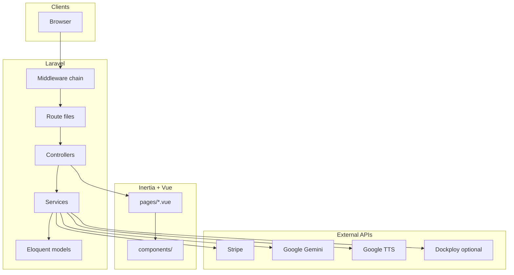

# Architecture

## Technology stack

| Layer | Technology |
|-------|------------|
| Backend | PHP 8.2+, Laravel 12 |
| Frontend | Vue 3, TypeScript, Inertia.js v2 |
| Auth | Laravel Fortify (login, 2FA, password reset, email verification) |
| Routing (typed URLs) | Laravel Wayfinder → `resources/js/routes/` |
| UI (app) | Tailwind CSS 4, shadcn-vue-style components under `resources/js/components/ui/` |
| UI (marketing) | Custom CSS `resources/css/marketing-home.css` |
| Payments | `stripe/stripe-php` |
| PDF | `barryvdh/laravel-dompdf` |
| Build | Vite 7, Node 22+ |
| Default DB | SQLite (Docker/local); supports MySQL via `.env` |
| Session / cache / queue | Database drivers by default |

## High-level diagram



## Request pipeline (every web request)

Order matters. Defined in `bootstrap/app.php`:

1. **`SetInstitutionContext`** — Detects `Institution` from subdomain, custom domain, route param, or authenticated user; attaches to `$request->attributes`; may redirect if missing on protected paths.
2. **`HandleAppearance`** — Light/dark preference cookie.
3. **`HandleInertiaRequests`** — Shared Inertia props (auth user, institution, flash, etc.).
4. **Route-specific middleware** — e.g. `EnsureAdminRole`, `EnsureInstitutionAccess`, `EnsureSubscriptionActive`.

## Route organization

`routes/web.php` only `require`s feature files:

| File | Scope |
|------|--------|
| `site.php` | Home, login/logout, institution registration, subscription checkout, dashboard redirect |
| `admin.php` | `/admin/*` — platform admin (no institution tenancy required) |
| `institution.php` | `/institution/*` — institution admin |
| `lecturer.php` | `/lecturer/*` — lecturer |
| `student.php` | `/student/*` — student |
| `generation.php` | `/api/viva/*` — AI/TTS JSON APIs (auth required) |
| `settings.php` | Profile, password, 2FA |

## Application layering convention

```
Controller  →  Service  →  Model
     ↓
 Inertia::render('role/Page', props)
```

- **Controllers** — HTTP validation, authorization checks, Inertia responses.
- **Services** — Query scoping, business rules, external API calls.
- **Models** — Eloquent relationships; minimal logic (e.g. `Viva::closeOverdueVivas()`).

Namespaces:

- `App\Services\Application\` — Tenant-facing features
- `App\Services\Admin\` — Platform admin
- `App\Services\Ai\` — Gemini, TTS, rubric helpers

## Multi-tenancy model

Tenancy is **institution-scoped**, not row-level security framework:

- Almost all queries filter by `institution_id` in services.
- **Subdomain** identifies tenant on the wire: `university-slug.talenttune.test`.
- **Users** have `institution_id`; middleware ensures user matches detected institution.
- **Admins** bypass institution matching but use separate `/admin` routes.

Reserved subdomains (`APP_RESERVED_SUBDOMAINS`) never map to institutions—e.g. `www`, `app`, `talenttune`.

Config: `config/domain.php` ← `APP_DOMAIN`, `APP_RESERVED_SUBDOMAINS`, `APP_LOCAL_TLD`.

## Dashboard redirect

`GET /dashboard` (`DashboardController::redirect`) sends users to role home:

- `admin` → `/admin/dashboard`
- `institution` → institution subdomain + `/institution/dashboard` (or complete-subscription if no access)
- `lecturer` → `/lecturer/dashboard`
- `student` → `/student/dashboard`

Logic centralized in `AuthRedirectService`.

## File storage

- Default disk: `local` (`FILESYSTEM_DISK`).
- Student documents and voice files stored on disk; paths on `viva_student_submissions` (`document_path`, `answers` JSON with voice paths).
- Lecturers/students stream files through authenticated controller routes (not public URLs).

## Frontend delivery

- Single Inertia root: `resources/views/app.blade.php`.
- Page components resolved from `resources/js/pages/{path}.vue`.
- Marketing homepage: `home/LandingPage.vue` with dedicated CSS import.
- Authenticated app: layouts `AppLayout` → `AppSidebarLayout` with class `viva-app` / `viva-app-content`.

## Health check

`GET /up` — Laravel health route (configured in `bootstrap/app.php`).
