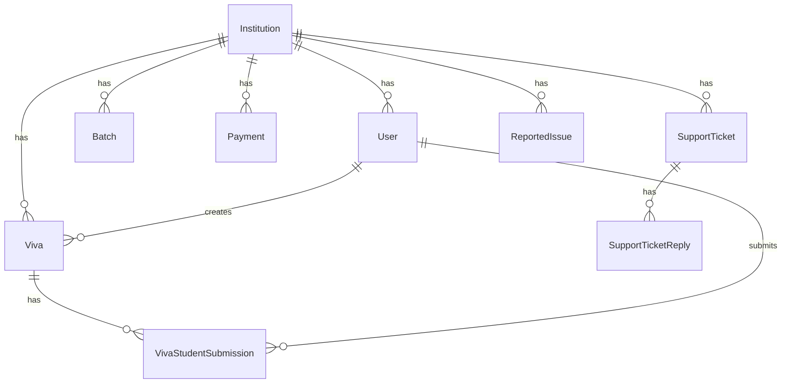

# Domain model

## Entity relationship (core)



## Institution

**Table:** `institutions`  
**Route key:** `slug` (used in URLs and subdomains)

| Field | Purpose |
|-------|---------|
| `name`, `slug` | Display name and subdomain identifier |
| `domain` | Optional custom hostname |
| `is_active` | Admin can deactivate; inactive blocks access |
| `settings` | JSON: email, contact, legacy fields |
| `stripe_customer_id`, `stripe_subscription_id` | Stripe linkage |
| `subscription_status` | e.g. `active` when paid |
| `trial_ends_at` | 14-day trial on create/activation |

**Scopes:** `active()` — used when resolving institution from host.

## User

**Table:** `users`

| Field | Purpose |
|-------|---------|
| `role` | `admin`, `institution`, `lecturer`, `student` |
| `institution_id` | Tenant FK (null for platform admins) |
| `batch` | Student cohort label (string, matches viva.batch) |
| `email`, `password` | Auth (Fortify) |
| Two-factor columns | Fortify 2FA |

## Batch

**Table:** `batches`

Institution-defined batch names used to group students. Vivas reference `viva.batch` as a string (not always FK to `batches.id`—check migrations/services for how batch list is enforced).

## Viva

**Table:** `vivas`

| Field | Purpose |
|-------|---------|
| `institution_id`, `lecturer_id` | Ownership |
| `title`, `description` | Exam metadata |
| `batch` | Which students can see this viva |
| `scheduled_at`, `due_at` | Timing; overdue auto-close |
| `instructions`, `lecture_materials`, `viva_background`, `base_prompt` | Lecturer configuration for AI |
| `status` | `upcoming`, `active`, `completed` (see services for transitions) |

**Important:** `Viva::closeOverdueVivas()` sets `completed` when `due_at <= now()` UTC—called when listing/showing vivas.

## VivaStudentSubmission

**Table:** `viva_student_submissions`

| Field | Purpose |
|-------|---------|
| `viva_id`, `student_id` | Unique participation (unique constraint dropped in migration—multiple attempts policy: check service) |
| `document_path` | Uploaded file storage path |
| `answers` | JSON array: questions, voice file paths, scores, transcripts |
| `total_score`, `grade`, `feedback` | Grading outcome |
| `status` | e.g. in progress / completed |
| `allowed_after_close` | Lecturer can allow late participation after viva closed |

## Payment

**Table:** `payments`

Records Stripe-related payments for admin reporting (amount, status, institution linkage).

## SupportTicket / SupportTicketReply

Institution raises tickets; platform admin replies. Status workflow managed in admin controllers.

## ReportedIssue

Student or lecturer reports problems; institution admin reviews, can mark reviewed or escalate.

## Status conventions

| Entity | Typical values |
|--------|----------------|
| Viva | `upcoming`, `active`, `completed` |
| Submission | progress/completion states in service layer |
| Institution subscription | `active` + trial datetime |
| Payment | `completed`, `pending`, etc. |

Always confirm in `*Service.php` before assuming enum values—some are string columns without PHP enums.

## Indexes and scoping rule

**Every read/write for tenant data should include:**

```php
->where('institution_id', $institution->id)
```

For student-facing viva lists, also filter by `$user->batch`.
