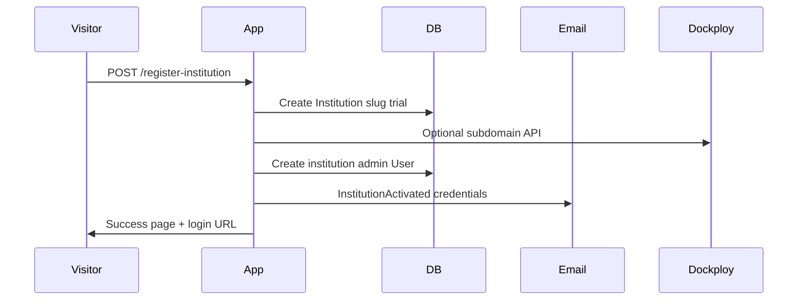
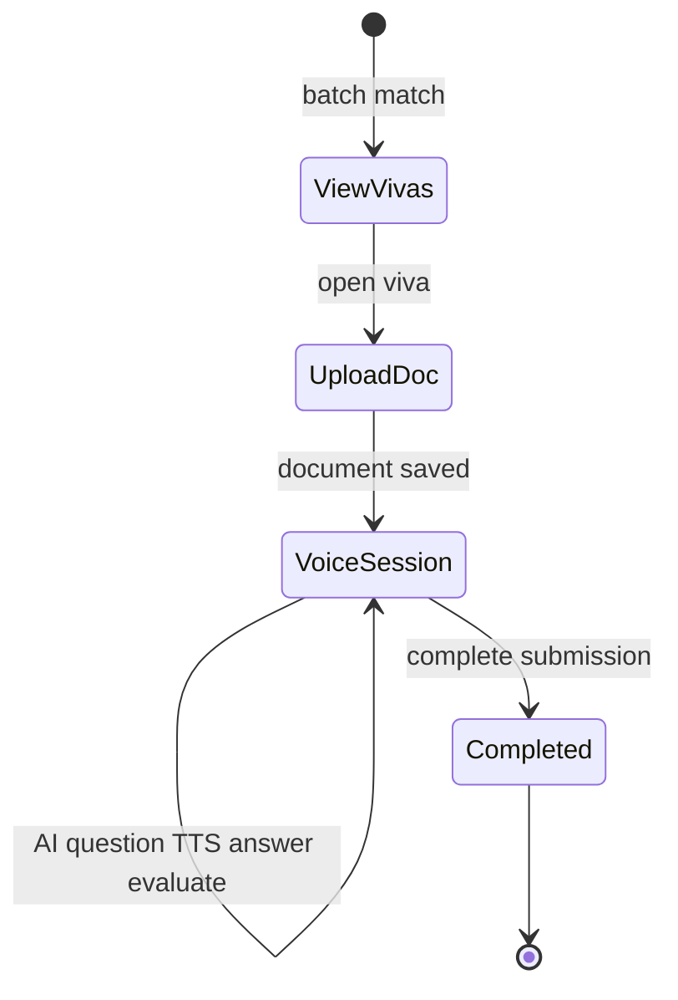

# Core flows

## 1. Institution registration (public)

**Service:** `InstitutionService::create()`

- Generates unique `slug` from name.
- Sets `is_active = true`, `trial_ends_at = now + 14 days`.
- Creates subdomain via `DockployDomainService` if `DOCKPLOY_*` configured.
- `activateInstitution()` creates `role=institution` user with random password; notification email.

**Careful:** Admin credentials and trial timing are business-critical—see [09-operations-and-caveats.md](./09-operations-and-caveats.md).

## 2. Login and tenant routing

1. User visits `{slug}.{APP_DOMAIN}/login`.
2. `SetInstitutionContext` binds institution.
3. Login validates email/password (+ optional role).
4. `AuthRedirectService` redirects to role dashboard on correct host.
5. Institution admin without `hasAccess()` → `complete-subscription`.

## 3. Subscription (Stripe)

**Paths:**

- Public: `subscribe/{institution}` — checkout for a given institution.
- Logged-in institution: `institution/complete-subscription`.

**Service:** `StripeSubscriptionService`

- Creates Stripe customer if needed.
- Checkout session with `STRIPE_PRICE_ID`.
- On success: `activateFromCheckoutSession()` sets `subscription_status`, stores subscription IDs.

Institution features (except checkout routes) require `hasAccess()` via middleware.

## 4. Institution admin: members and batches

| Action | Route area |
|--------|------------|
| CRUD lecturers | `institution/lecturers/*` |
| CRUD students | `institution/students/*` |
| Manage batches | `institution/batches` |
| Reports PDF | `institution/reports/*-pdf` |
| Support | `institution/support/*` |
| Reported issues | `institution/reported-issues/*` |

New users typically receive email with generated passwords (`InstitutionUserController` + notifications).

## 5. Lecturer: create and manage viva

1. **Create** — `lecturer/vivas/create` → store with instructions, materials (files/metadata), batch, schedule, due date, prompts.
2. **List** — Vivas for institution; overdue closed via `closeOverdueVivas()`.
3. **Show** — View student submissions, stream document/voice, close viva, add late students.

**Service:** `LecturerService`

## 6. Student: attend viva (critical path)

**Routes:**

| Step | Route |
|------|--------|
| List | `GET student/vivas` |
| Attend UI | `GET student/vivas/{id}/attend` |
| Upload document | `POST student/vivas/{id}/upload-document` |
| Upload voice | `POST student/vivas/{id}/upload-voice` |
| Complete | `POST student/vivas/complete-submission` |
| View result | `GET student/vivas/{id}/submission` |

**Frontend:** `student/VivaAttend.vue` + `VivaSessionPanel.vue` — uses RecordRTC, calls `/api/viva/*`.

**Service:** `StudentService` — storage, submission JSON structure, rubric finalization via `RubricService`.

## 7. AI-assisted viva (API)

All under `routes/generation.php`, middleware `auth`:

| Endpoint | Purpose |
|----------|---------|
| `POST api/viva/tts` | Text-to-speech for questions |
| `POST api/viva/instructions/generate` | Generate instructions from lecturer input |
| `POST api/viva/questions/generate` | Generate question from document/context |
| `POST api/viva/answer/evaluate` | Score/evaluate student answer |
| `POST api/viva/conversation/response` | Conversational follow-up |

**Controllers:** `App\Http\Controllers\Ai\GeminiController`, `TTSController`  
**Services:** `GeminiQuestionService`, `GeminiFileService`, `TTSService`, `RubricService`, etc.

Requires `GEMINI_API_KEY`, `GOOGLE_TTS_API_KEY` in environment.

## 8. Platform admin

- Dashboard analytics (institutions, users, vivas, revenue charts).
- Institution CRUD, activate/deactivate, end trial.
- Global user list/edit.
- Payments list/detail.
- Support tickets.
- PDF reports (payments, P&L).
- TalentTune admin user management.

## 9. Marketing site

- `LandingPage.vue` — hero, how-it-works modal, features, workspace showcase, pricing, CTA.
- Register institution uses `MarketingLayout`.
- Anchors: `#how`, `#features`, `#workspace`, `#roles`, `#pricing`.

## 10. Reported issues (cross-role)

| Role | Action |
|------|--------|
| student / lecturer | Create issue |
| institution | List, show, mark reviewed, escalate |
| admin | Via separate admin tooling if extended |

Issue records tie to institution and reporter user.
